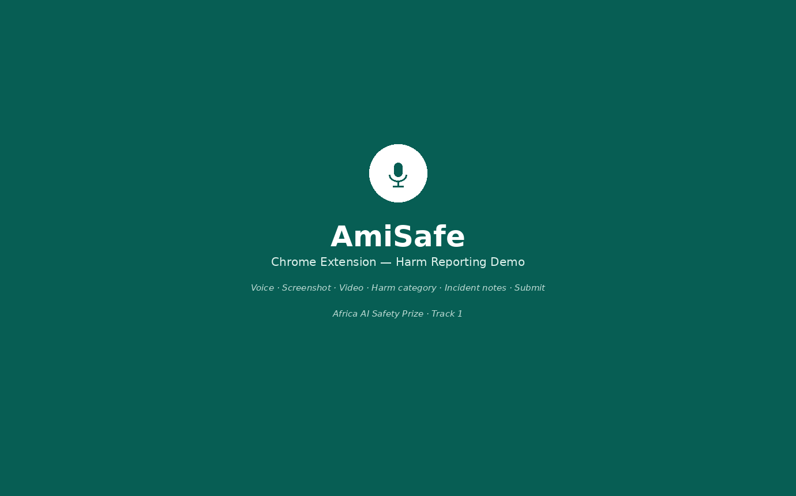
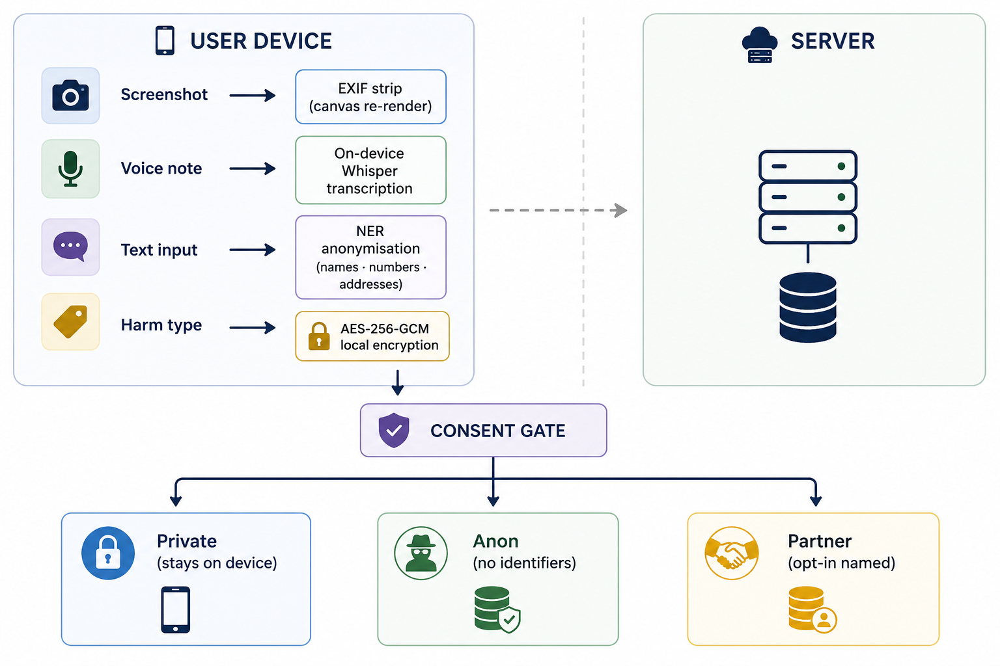
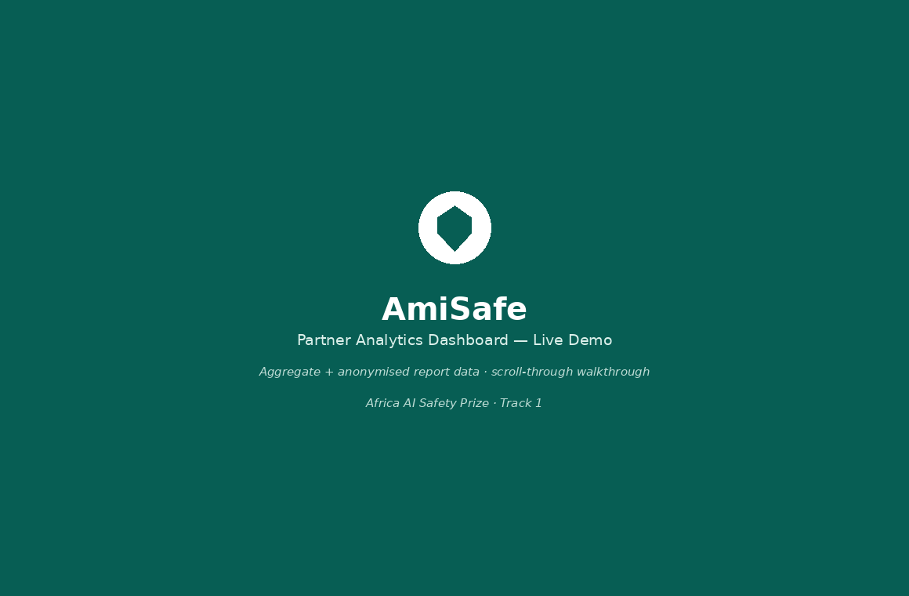

<div align="center">


<br/>
<br/>

**Community-led AI harm reporting for Africa — private, multilingual, open source.**

<br/>

[](https://casa-ai.org)
[](LICENSE)
[](https://nodejs.org)
[](CONTRIBUTING.md)
[](#-harm-taxonomy)

<br/>

*AmiSafe turns everyday community members into credible AI harm reporters —*  
*no account, no technical knowledge, no compromise on privacy.*

<br/>

[**📦 Quick Start**](#-quick-start) · [**🏗 Architecture**](#-architecture) · [**🔒 Privacy**](#-privacy-architecture) · [**🌍 Languages**](#-harm-taxonomy) · [**📊 Dashboard**](#-how-pattern-detection-works) · [**🤝 Contribute**](#-contributing)

---

</div>

## What is AmiSafe?

AI-generated harms — deepfakes, political misinformation in local languages, discriminatory hiring algorithms, dangerous health chatbot outputs — are experienced daily across Africa. Yet they go almost entirely **unrecorded**.

AmiSafe fills that gap. It is a privacy-first, multilingual reporting system that lets any internet user capture evidence of AI harm and submit it safely — via a **browser extension** or a **WhatsApp bot** — feeding a structured intelligence database that researchers, civil society, and regulators can act on.

> *"A woman in Lagos who receives a deepfake of herself can submit an evidenced, anonymised report in Yoruba in under 3 minutes — rather than watching it disappear on WhatsApp."*

<br/>

---

## 🏗 Architecture

```
amisafe/
│
├── extension/        🔌  Browser extension  (Chrome + Firefox · Manifest V3)
│   ├── popup/            4-step report flow UI
│   ├── background/       Service worker · offline queue · audio transcription
│   ├── utils/            AES-256 crypto · EXIF strip · rotating pseudo-ID · i18n
│   └── _locales/         UI strings in 9 African languages
│
├── api/              ⚙️  REST API backend  (Node.js · Express · PostgreSQL · Redis)
│   ├── src/routes/       Reports · Patterns · Stats · Admin
│   ├── src/services/     Anonymiser · Classifier · Pattern detector
│   └── db/               PostgreSQL schema + migrations
│
├── bot/              💬  WhatsApp companion bot  (whatsapp-web.js)
│   └── src/handlers/     Conversational state machine · voice note handling
│
├── dashboard/        📊  Public intelligence dashboard  (React · Recharts · Vite)
│   └── src/              KPIs · 30-day trend · patterns table · platform breakdown
│
└── shared/           🗂  Cross-package constants
    └── harm-taxonomy.json    8 harm categories × 9 languages
```

<br/>

---

## 🚀 Quick Start

### Prerequisites

| Requirement | Version |
|---|---|
| Node.js | ≥ 18 |
| Docker + Docker Compose | latest |
| Chromium-based browser | for extension development |

<br/>

**1 — Clone and install**

```bash
git clone https://github.com/your-org/amisafe.git
cd amisafe
npm install            # root workspace deps
npm run install:all    # all package deps
```

**2 — Environment setup**

```bash
cp api/.env.example api/.env
cp bot/.env.example bot/.env
# Edit both files with your credentials before continuing
```

**3 — Start services**

```bash
docker-compose up -d
# PostgreSQL  →  :5432
# API         →  :3001
# Dashboard   →  :5173
```

**4 — Run database migrations**

```bash
npm run db:migrate
```

**5 — Load the browser extension**

```
1. Open    chrome://extensions
2. Enable  Developer mode        (top-right toggle)
3. Click   Load unpacked    →    select the extension/ folder
```

**6 — Start the WhatsApp bot**

```bash
cd bot && npm start
# A QR code appears — scan it with WhatsApp on your phone
```

<br/>

### 🔌 Browser Extension — Capturing a Harm Report

The extension guides any user through a 4-step reporting flow directly in their browser. Reports are encrypted and anonymised on-device before anything is transmitted.

<div align="center">
  
  <br/>
  <sub><i>Capturing and submitting a deepfake report in Yoruba · AmiSafe Browser Extension</i></sub>
</div>

<br/>

---

## 🔒 Privacy Architecture

> Every report passes through four mandatory privacy layers **before leaving the device**.  
> No account, email address, or phone number is required at any point — ever.

<div align="center">
  
  <br/>
  <sub><i>On-device pipeline: EXIF strip → transcription → NER anonymisation → encryption → consent gate</i></sub>
</div>

<br/>

| Layer | Mechanism | What is removed |
|---|---|---|
| 🖼 **EXIF strip** | Canvas re-render | GPS coordinates · device model · capture timestamp |
| 🔍 **NER anonymisation** | Compromise NER + regex sweep | Names · phone numbers · emails · ID numbers |
| 🎭 **Pseudo-ID** | AES-GCM rotating key (30-day cycle) | Any link between reports and reporter identity |
| 🔐 **Local encryption** | AES-256-GCM | All report content encrypted at rest on-device |

<br/>

---

## 🤐 Disclosure Levels

Before any report leaves the device, the reporter explicitly chooses one of three options:

| Level | What happens | Who can see it |
|---|---|---|
| 🔒 **Keep private** | Encrypted and stored locally only. Never transmitted. | Nobody — device only |
| 🔬 **Anon research** | Pseudonymous, all identifiers stripped before transmission. | Researchers — aggregate patterns only |
| 🤝 **Verified partner** | Optional named share with a vetted civil society organisation. | Named, vetted partner org |

<br/>

---

## 🌍 Harm Taxonomy

Eight harm categories, fully localised in **9 African languages** from launch.  
See [`shared/harm-taxonomy.json`](shared/harm-taxonomy.json) for all translations.

| # | Category ID | English | ha | yo | sw | am |
|---|---|---|:---:|:---:|:---:|:---:|
| 🎭 | `deepfake` | Fake image or video | ✅ | ✅ | ✅ | ✅ |
| 📰 | `misinformation` | False information | ✅ | ✅ | ✅ | ✅ |
| ⚖️ | `discrimination` | Unfair treatment by AI | ✅ | ✅ | ✅ | ✅ |
| 🚨 | `harassment` | Harassment or intimidation | ✅ | ✅ | ✅ | ✅ |
| 💸 | `financial_harm` | Financial harm | ✅ | ✅ | ✅ | ✅ |
| 🏥 | `health_misinfo` | Health misinformation | ✅ | ✅ | ✅ | ✅ |
| 🔓 | `privacy_violation` | Privacy violation | ✅ | ✅ | ✅ | ✅ |
| ❓ | `other` | Other harm | ✅ | ✅ | ✅ | ✅ |

**All 9 supported languages:**  
Hausa · Yorùbá · Igbo · Kiswahili · አማርኛ · Soomaali · isiZulu · Nigerian Pidgin · English

<br/>

---

## 📡 API Reference

> Rate limited to **30 requests / minute** per origin.  
> Partner endpoints require an `X-Partner-Key` header.

| Method | Path | Auth | Description |
|---|---|---|---|
| `POST` | `/api/reports` | — | Submit a harm report |
| `GET` | `/api/stats` | — | Aggregate statistics (public) |
| `GET` | `/api/patterns` | — | Confirmed + emerging pattern clusters |
| `GET` | `/api/patterns/:id` | — | Single pattern detail |
| `POST` | `/api/admin/signal` | Partner key | Dispatch a safety signal report |
| `GET` | `/api/admin/clusters` | Partner key | Full cluster list with report counts |
| `GET` | `/health` | — | Service health check |

<br/>

---

## 📊 How Pattern Detection Works

```
 New report arrives
        │
        ▼
 NLP semantic cluster  ──►  Harm classifier  ──►  Geo-temporal index
        │
        ▼
 ≥ 5 similar reports in same                NO  ──►  Stored as unclassified
 category + platform + country                      (re-evaluated on next report)
 within a 14-day window?
        │ YES
        ▼
 Pattern cluster CONFIRMED
        │
        ▼
 Safety Signal Report generated
        │
        ├──►  AI developer or open-source maintainer
        ├──►  National regulator  (NITDA · CA Kenya · ARTP · etc.)
        └──►  Civil society partner monthly digest
```

Confirmed patterns, real-time KPIs, and platform breakdowns are surfaced on the public intelligence dashboard — so researchers, journalists, and regulators can act on aggregated signals without ever seeing individual reports.

<br/>

<div align="center">
  
  <br/>
  <sub><i>Public intelligence dashboard · 30-day trend · confirmed pattern clusters · platform breakdown</i></sub>
</div>

<br/>

---

## 📁 Key Files Reference

| File | Purpose |
|---|---|
| [`shared/harm-taxonomy.json`](shared/harm-taxonomy.json) | Single source of truth — all harm categories and language strings |
| [`api/db/init.sql`](api/db/init.sql) | Full PostgreSQL schema |
| [`extension/utils/crypto.js`](extension/utils/crypto.js) | AES-256-GCM on-device encryption |
| [`extension/utils/exif-stripper.js`](extension/utils/exif-stripper.js) | Canvas-based metadata removal |
| [`extension/utils/pseudo-id.js`](extension/utils/pseudo-id.js) | 30-day rotating anonymous reporter ID |
| [`api/src/services/anonymiser.js`](api/src/services/anonymiser.js) | NER + regex PII stripping pipeline |
| [`api/src/services/pattern-detector.js`](api/src/services/pattern-detector.js) | Redis queue + semantic clustering logic |
| [`ETHICS.md`](ETHICS.md) | Project ethics code — read before contributing |

<br/>

---

## 🤝 Contributing

Contributions are welcome — code, translations, documentation, and community testing.  
Please read [`CONTRIBUTING.md`](CONTRIBUTING.md) and [`ETHICS.md`](ETHICS.md) before opening a pull request.

```bash
# Fork, clone, branch
git clone https://github.com/your-org/amisafe.git
git checkout -b feat/your-feature-name

# Commit with conventional commits
git commit -m "feat(extension): add Somali locale strings"
git commit -m "fix(api): prevent double-submission on retry"

# Push and open a pull request
```

### 🌐 Adding a new language

```
1. Copy   extension/_locales/en/messages.json
      →   extension/_locales/<lang>/messages.json
2. Translate all "message" values (keep keys unchanged)
3. Add the language code to shared/harm-taxonomy.json → supportedLanguages
4. Add translations for each category in harm-taxonomy.json
5. Add the <option> to the popup language selector in popup.html
6. Add the mapping to LANG_MAP in bot/src/handlers/report-flow.js
```

<br/>

---

## 📜 Licence

```
Copyright 2026 AmiSafe Contributors

Licensed under the Apache License, Version 2.0.
You may obtain a copy at https://www.apache.org/licenses/LICENSE-2.0
```

**Community-generated data remains the property of the communities that produced it.**  
AmiSafe is a steward, not an owner.

<br/>

---

<div align="center">

Built with care for African communities &nbsp;·&nbsp; Africa AI Safety Prize 2026

*If AmiSafe is useful to your community, please ⭐ the repository and share it.*

</div>